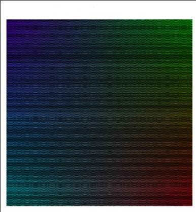
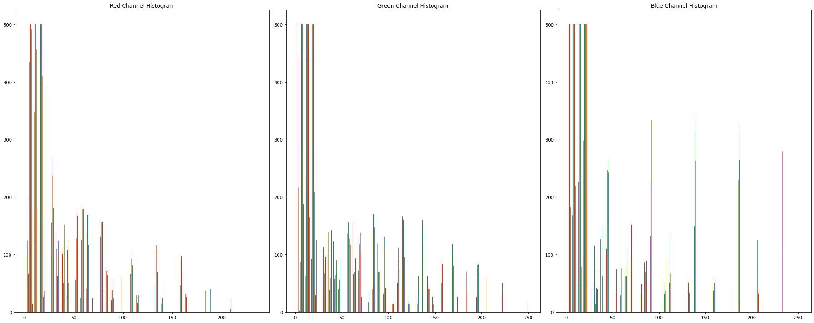

# Fabric Pattern Image Generator

### This Python script generates a fabric pattern image with smooth color gradients and simulates cloth strands.

|                    Pattern                    |                 Another pattern                 |
| :-------------------------------------------: | :---------------------------------------------: |
|  |  |

### The resulting image is displayed and separated into its RGB channels, with histograms plotted for each channel.

  
  

### Additionally, the script calculates the mean and standard deviation of the generated image.
