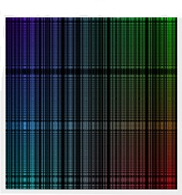
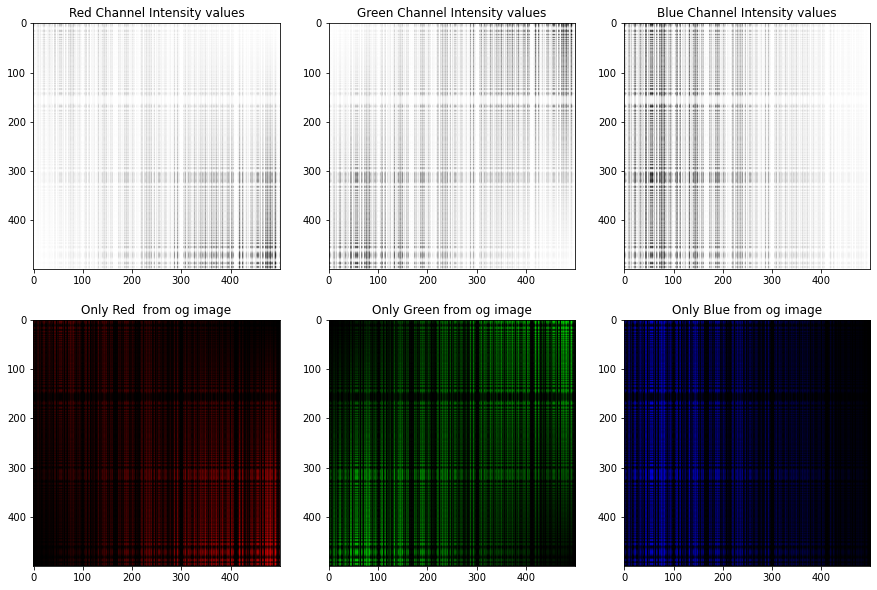

# Fabric Pattern Image Generator

### This Python script generates a fabric pattern image with smooth color gradients and simulates cloth strands.

  

### The resulting image is displayed and separated into its RGB channels, with histograms plotted for each channel.

  

### Additionally, the script calculates the mean and standard deviation of the generated image.
